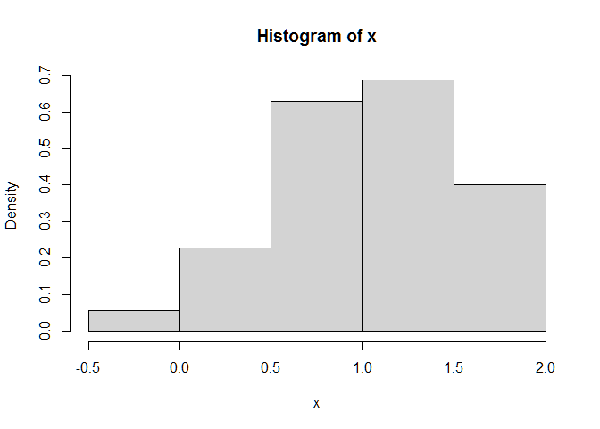
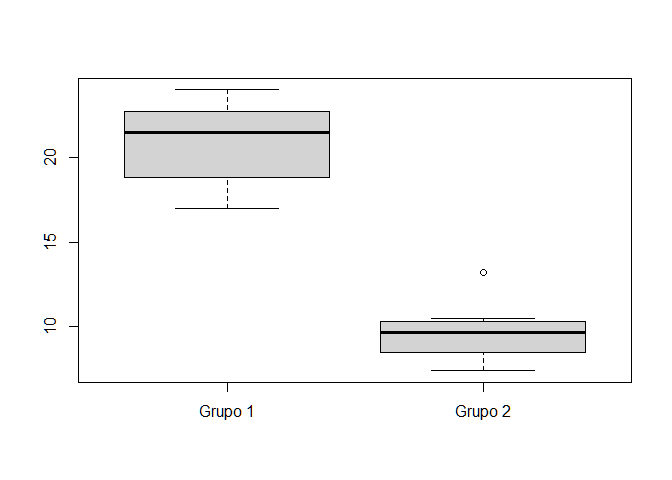
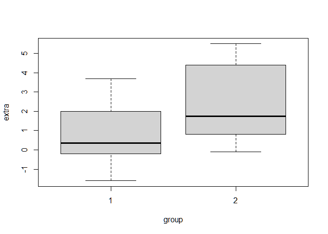

## Pruebas de hipótesis
_______________________________________________

Prueba de hipótesis en caballos con varianza hipotética de la población
de 13.4621 sd 3.669073

```ruby
    CAB <- c(2.0, 1.1, 4.4, -3.1, -1.3, 3.9, 3.2, -1.6, 3.5, 1.2, 2.5, 2.3, 1.9, 1.8, 2.9, -0.3, -2.4)
    length(CAB)

    ## [1] 17

    mean(CAB)

    ## [1] 1.294118

    ESCAB <- 3.669073 / sqrt(length(CAB))
    ZCAB <- (mean(CAB) - 0) / (ESCAB)
    ZCAB

    ## [1] 1.454259
```

#### Prueba de z mediante el paquete BSDA
```ruby
    library(BSDA)

    ## Warning: package 'BSDA' was built under R version 4.1.3

    ## Loading required package: lattice

    ## 
    ## Attaching package: 'BSDA'

    ## The following object is masked from 'package:datasets':
    ## 
    ##     Orange

    z.test(CAB, # Variable CAB
      sigma.x = 3.669073, # Desviación estándar de la población
      mu = 0, # media contra la cual se comparan los datos
      conf.level = 0.05
    ) # Nivel de confianza

    ## 
    ##  One-sample z-Test
    ## 
    ## data:  CAB
    ## z = 1.4543, p-value = 0.1459
    ## alternative hypothesis: true mean is not equal to 0
    ## 5 percent confidence interval:
    ##  1.238316 1.349919
    ## sample estimates:
    ## mean of x 
    ##  1.294118
```
### Prueba de t de Student

#### Hipótesis de dos colas para la media de la población en comparación con media hipotética

```ruby
    crab <- c(
      25.8, 24.6, 26.1, 22.9, 25.1, 27.3, 24.0, 24.5, 23.9,
      26.2, 24.3, 24.6, 23.3, 25.5, 28.1, 24.8, 23.5,
      26.3, 25.4, 25.5, 23.9, 27.0, 24.8, 22.9, 25.4
    )

    hipo <- c(24.3) # Media hipotética
    mean(crab) # Media de la variable

    ## [1] 25.028

    length(crab) # Número de elementos

    ## [1] 25

    var(crab) # Varianza

    ## [1] 1.800433

    sd(crab) # Desviación

    ## [1] 1.341802

    ES <- sd(crab) / sqrt(length(crab)) # Error estándar de la media
    t <- ((mean(crab) - hipo) / ES) # Prueba de t
    t

    ## [1] 2.712769

    t.test(x = crab, mu = hipo)

    ## 
    ##  One Sample t-test
    ## 
    ## data:  crab
    ## t = 2.7128, df = 24, p-value = 0.01215
    ## alternative hypothesis: true mean is not equal to 24.3
    ## 95 percent confidence interval:
    ##  24.47413 25.58187
    ## sample estimates:
    ## mean of x 
    ##    25.028
```

### Hipótesis de una cola
```ruby
    peso <- c(0.2, -0.5, -1.3, -1.6, -0.7, 0.4, -0.1, 0.0, -0.6, -1.1, -1.2, -0.8)

    t.test(
      x = peso, # Variable peso
      mu = 0, # Media hipotética
      alternative = "less"
    ) # less indica que la cola es hacia abajo, es decir,

    ## 
    ##  One Sample t-test
    ## 
    ## data:  peso
    ## t = -3.3285, df = 11, p-value = 0.003364
    ## alternative hypothesis: true mean is less than 0
    ## 95 percent confidence interval:
    ##        -Inf -0.2801098
    ## sample estimates:
    ##  mean of x 
    ## -0.6083333

    # queremos ver si nuestra media es menor a cero.
    # Caso contrario sería "greater"

### Comparación entre las medias de dos poblaciones

#### Prueba Z

    nx <- 12
    ny <- 15
    x <- 4.5
    y <- 3.4
    mu <- 0
    sigx <- 1
    sigy <- 1.5
    Pz <- ((x - y) - 0) / sqrt((sigx / nx) + (sigy / ny))
    Pz

    ## [1] 2.569047

    # Como el valor de Z es  2.57 es mayor que 1.96 H0 se rechaza
    pnorm(-Pz) * 2 # Para calcular el valor de p para la distribución z de dos colas

    ## [1] 0.01019788

    # Uso de la librería BSDA
    library(BSDA)
    x <- rnorm(12, 4.5, 1)
    y <- rnorm(15, 3.4, 1.5)
    z.test(x = x, y = y, sigma.x = 1, sigma.y = 1.5)

    ## 
    ##  Two-sample z-Test
    ## 
    ## data:  x and y
    ## z = 2.3622, p-value = 0.01817
    ## alternative hypothesis: true difference in means is not equal to 0
    ## 95 percent confidence interval:
    ##  0.1942797 2.0877848
    ## sample estimates:
    ## mean of x mean of y 
    ##  4.756506  3.615473

    # Ejemplo 2 con la librería
    x <- rnorm(35, 1, 0.5)
    y <- rnorm(35, 5, 1)
    hist(x, freq = F)
```



```ruby
    z.test(x, sigma.x = 1)

    ## 
    ##  One-sample z-Test
    ## 
    ## data:  x
    ## z = 6.2145, p-value = 5.149e-10
    ## alternative hypothesis: true mean is not equal to 0
    ## 95 percent confidence interval:
    ##  0.7191494 1.3817382
    ## sample estimates:
    ## mean of x 
    ##  1.050444

    z.test(x = x, y = y, alternative = "two.sided", conf.level = 0.05, sigma.x = 0.5, sigma.y = 1)

    ## 
    ##  Two-sample z-Test
    ## 
    ## data:  x and y
    ## z = -21.473, p-value < 2.2e-16
    ## alternative hypothesis: true difference in means is not equal to 0
    ## 5 percent confidence interval:
    ##  -4.069801 -4.046100
    ## sample estimates:
    ## mean of x mean of y 
    ##  1.050444  5.108394
```

#### Prueba de t para dos muestras independientes
```ruby
    library(graphics)
    t <- read.csv("C:/Users/INIFAP-LENOVO/Documents/MEGA/R_1/BDATOS/ttest.csv", header = T)
    n <- length(t$G1)
    head(t, n = 5)

    ##   P   G1   G2
    ## 1 1 23.0  8.5
    ## 2 2 17.4  9.6
    ## 3 3 17.0  7.7
    ## 4 4 20.5 10.1
    ## 5 5 22.7  9.7

    boxplot(t$G1, t$G2, names = c("Grupo 1", "Grupo 2"))
```



```ruby
    t.test(t$G1, t$G2, paired = F)

    ## 
    ##  Welch Two Sample t-test
    ## 
    ## data:  t$G1 and t$G2
    ## t = 11.747, df = 15.498, p-value = 4.014e-09
    ## alternative hypothesis: true difference in means is not equal to 0
    ## 95 percent confidence interval:
    ##   9.165269 13.214731
    ## sample estimates:
    ## mean of x mean of y 
    ##     20.80      9.61

    ?t.test

    ## starting httpd help server ... done
```

#### Cálculo del poder de la prueba de t de dos poblaciones
```ruby
    # El cálculo de la varianza y desviación estándar agrupadas
    psd <- read.csv("C:/Users/INIFAP-LENOVO/Documents/MEGA/R_1/BDATOS/poolsd.csv", header = T)
    n1 <- length(psd$G1)
    n2 <- length(psd$G2)
    s1 <- var(psd$G1)
    s2 <- var(psd$G2)
    vari <- ((n1 - 1) * (s1^2) + (n2 - 1) * (s2^2)) / (n1 + n2 - 2) # Varianza agrupada
    sdd <- sqrt(((n1 - 1) * (s1^2) + (n2 - 1) * (s2^2)) / (n1 + n2 - 2)) # Desviación estándar agrupada
    abs(mean(psd$G1) - mean(psd$G2)) # diferencia absoluta entre las medias

    ## [1] 11.19

    t.test(x = psd$G1, y = psd$G2) # Prueba de t para dos muestras independientes

    ## 
    ##  Welch Two Sample t-test
    ## 
    ## data:  psd$G1 and psd$G2
    ## t = 11.747, df = 15.498, p-value = 4.014e-09
    ## alternative hypothesis: true difference in means is not equal to 0
    ## 95 percent confidence interval:
    ##   9.165269 13.214731
    ## sample estimates:
    ## mean of x mean of y 
    ##     20.80      9.61

    # Poder de la hipótesis en la prueba de t en una distribución de dos colas
    power.t.test(
      n = 10, ## Tamaño de la muestra
      delta = 11.19, ## Diferencia entre las medias
      sd = sdd, ## Desviación
      sig.level = 0.05, ## El nivel de significancia de la prueba
      type = "two.sample", ## Tipo de prueba
      alternative = "two.sided"
    ) ## Distribución una o dos colas

    ## 
    ##      Two-sample t test power calculation 
    ## 
    ##               n = 10
    ##           delta = 11.19
    ##              sd = 4.889642
    ##       sig.level = 0.05
    ##           power = 0.9979418
    ##     alternative = two.sided
    ## 
    ## NOTE: n is number in *each* group

##### Otro ejemplo: <http://stat.ethz.ch/R-manual/R-patched/library/stats/html/t.test.html>

##### Classical example: Student’s sleep data

    plot(extra ~ group, data = sleep)
```



```ruby
    head(sleep)

    ##   extra group ID
    ## 1   0.7     1  1
    ## 2  -1.6     1  2
    ## 3  -0.2     1  3
    ## 4  -1.2     1  4
    ## 5  -0.1     1  5
    ## 6   3.4     1  6
```
##### Interface de la fórmula
```ruby
    t.test(extra ~ group, data = sleep)

    ## 
    ##  Welch Two Sample t-test
    ## 
    ## data:  extra by group
    ## t = -1.8608, df = 17.776, p-value = 0.07939
    ## alternative hypothesis: true difference in means between group 1 and group 2 is not equal to 0
    ## 95 percent confidence interval:
    ##  -3.3654832  0.2054832
    ## sample estimates:
    ## mean in group 1 mean in group 2 
    ##            0.75            2.33
```
[Ir al contenido](https://github.com/rubio-e/Tutorial_R/blob/main/README.md#m%C3%B3dulos)
