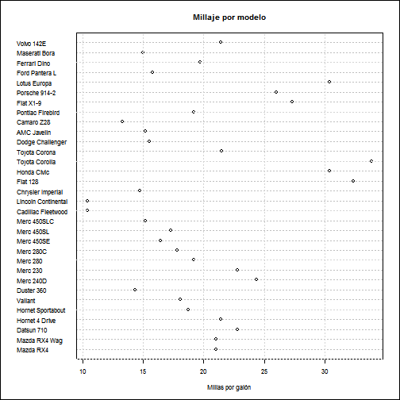
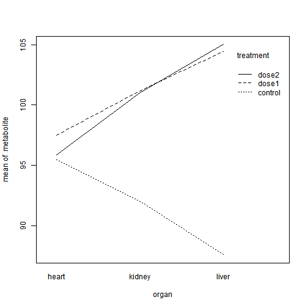
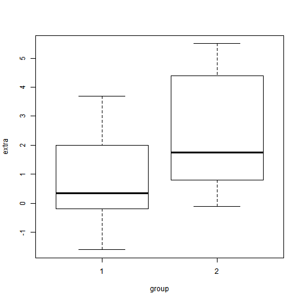

Pruebas de hipótesis
========================================================
### Prueba de hipótesis en caballos con varianza hipotética de la población de 13.4621  sd 3.669073


```r
CAB <- c(2, 1.1, 4.4, -3.1, -1.3, 3.9, 3.2, -1.6, 3.5, 1.2, 2.5, 2.3, 1.9, 1.8, 
    2.9, -0.3, -2.4)
length(CAB)
```

```
## [1] 17
```

```r
mean(CAB)
```

```
## [1] 1.294
```

```r
ESCAB <- 3.669073/sqrt(length(CAB))
ZCAB <- (mean(CAB) - 0)/(ESCAB)
ZCAB
```

```
## [1] 1.454
```


## Prueba de z mediante el paquete BSDA


```r
library(BSDA)
```

```
## Loading required package: e1071
## Loading required package: lattice
## 
## Attaching package: 'BSDA'
## 
## The following object is masked from 'package:datasets':
## 
##     Orange
```

```r
z.test(CAB,               # Variable CAB
       sigma.x=3.669073,  # Desviación estándar de la población
       mu=0,              # media contra la cual se comparan los datos
       conf.level=0.05)   # Nivel de confianza
```

```
## 
## 	One-sample z-Test
## 
## data:  CAB
## z = 1.454, p-value = 0.1459
## alternative hypothesis: true mean is not equal to 0
## 5 percent confidence interval:
##  1.238 1.350
## sample estimates:
## mean of x 
##     1.294
```


# Prueba de t de estudent
## Hipótesis de dos colas para la media de la población en comparación con media hipotética

```r
crab <- c(25.8, 24.6, 26.1, 22.9, 25.1, 27.3, 24, 24.5, 23.9, 26.2, 24.3, 24.6, 
    23.3, 25.5, 28.1, 24.8, 23.5, 26.3, 25.4, 25.5, 23.9, 27, 24.8, 22.9, 25.4)
hipo <- c(24.3)  # Media hipotética
mean(crab)  # Media de la variable
```

```
## [1] 25.03
```

```r
length(crab)  # Número de elementos
```

```
## [1] 25
```

```r
var(crab)  # Varianza
```

```
## [1] 1.8
```

```r
sd(crab)  # Desviación
```

```
## [1] 1.342
```

```r
ES <- sd(crab)/sqrt(length(crab))  # Error estándar de la media
t <- ((mean(crab) - hipo)/ES)  # Prueba de t
t
```

```
## [1] 2.713
```

```r
t.test(x = crab, mu = hipo)
```

```
## 
## 	One Sample t-test
## 
## data:  crab
## t = 2.713, df = 24, p-value = 0.01215
## alternative hypothesis: true mean is not equal to 24.3
## 95 percent confidence interval:
##  24.47 25.58
## sample estimates:
## mean of x 
##     25.03
```


# Hipótesis de una cola 

```r
peso<-c(0.2,-0.5,-1.3,-1.6,-0.7,0.4,-0.1,0.0,-0.6,-1.1,-1.2,-0.8)

t.test(x=peso,              # Variable peso
       mu=0,                # Media hipotética
       alternative="less")  # less indica que la cola es hacia abajo, es decir, 
```

```
## 
## 	One Sample t-test
## 
## data:  peso
## t = -3.329, df = 11, p-value = 0.003364
## alternative hypothesis: true mean is less than 0
## 95 percent confidence interval:
##     -Inf -0.2801
## sample estimates:
## mean of x 
##   -0.6083
```

```r
                            # queremos ver si nuestra media es menor a cero. 
                            # Caso contrario sería "greater"
```


# Comparación entre las medias de dos poblaciones
## Prueba Z

```r
nx = 12
ny = 15
x = 4.5
y = 3.4
mu = 0
sigx = 1
sigy = 1.5
Pz <- ((x - y) - 0)/sqrt((sigx/nx) + (sigy/ny))
Pz
```

```
## [1] 2.569
```

```r
# Como el valor de Z es 2.57 es mayor que 1.96 H0 se rechaza
pnorm(-Pz) * 2  # Para calcular el valor de p para la distribución z de dos colas
```

```
## [1] 0.0102
```

```r

# Uso de la librería BSDA
library(BSDA)
x <- rnorm(12, 4.5, 1)
y <- rnorm(15, 3.4, 1.5)
z.test(x = x, y = y, sigma.x = 1, sigma.y = 1.5)
```

```
## 
## 	Two-sample z-Test
## 
## data:  x and y
## z = 2.092, p-value = 0.03641
## alternative hypothesis: true difference in means is not equal to 0
## 95 percent confidence interval:
##  0.06392 1.95742
## sample estimates:
## mean of x mean of y 
##     5.086     4.075
```

```r

# Ejemplo 2 con la librería
x <- rnorm(35, 1, 0.5)
y <- rnorm(35, 5, 1)
hist(x, freq = F)
```

 

```r
z.test(x, sigma.x = 1)
```

```
## 
## 	One-sample z-Test
## 
## data:  x
## z = 6.659, p-value = 2.761e-11
## alternative hypothesis: true mean is not equal to 0
## 95 percent confidence interval:
##  0.7942 1.4568
## sample estimates:
## mean of x 
##     1.126
```

```r
z.test(x = x, y = y, alternative = "two.sided", conf.level = 0.05, sigma.x = 0.5, 
    sigma.y = 1)
```

```
## 
## 	Two-sample z-Test
## 
## data:  x and y
## z = -20.37, p-value < 2.2e-16
## alternative hypothesis: true difference in means is not equal to 0
## 5 percent confidence interval:
##  -3.862 -3.839
## sample estimates:
## mean of x mean of y 
##     1.126     4.976
```


## Prueba de t para dos muestras independientes

```r
library(graphics)
t <- read.csv("c:/Curso 1/ttest.csv", header = T)
n <- length(t$G1)
head(t, n = 5)
```

```
##   P   G1   G2
## 1 1 23.0  8.5
## 2 2 17.4  9.6
## 3 3 17.0  7.7
## 4 4 20.5 10.1
## 5 5 22.7  9.7
```

```r
boxplot(t$G1, t$G2, names = c("Grupo 1", "Grupo 2"))
```

 

```r
t.test(t$G1, t$G2, paired = F)
```

```
## 
## 	Welch Two Sample t-test
## 
## data:  t$G1 and t$G2
## t = 11.75, df = 15.5, p-value = 4.014e-09
## alternative hypothesis: true difference in means is not equal to 0
## 95 percent confidence interval:
##   9.165 13.215
## sample estimates:
## mean of x mean of y 
##     20.80      9.61
```

```r
`?`(t.test)
```

```
## starting httpd help server ... done
```


## Cálculo del poder de la prueba de t de dos poblaciones

```r
# El cálculo de la varianza y desviación estándar agrupadas
psd<-read.csv("c:/Curso 1/poolsd.csv", header=T)
n1<-length(psd$G1)
n2<-length(psd$G2)
s1<-var(psd$G1)
s2<-var(psd$G2)
vari<-((n1-1)*(s1^2)+(n2-1)*(s2^2))/(n1+n2-2)# Varianza agrupada
sdd<-sqrt(((n1-1)*(s1^2)+(n2-1)*(s2^2))/(n1+n2-2))# Desviación estándar agrupada
abs(mean(psd$G1)-mean(psd$G2))# diferencia absoluta entre las medias 
```

```
## [1] 11.19
```

```r

t.test(x=psd$G1,y=psd$G2) # Prueba de t para dos muestras independientes
```

```
## 
## 	Welch Two Sample t-test
## 
## data:  psd$G1 and psd$G2
## t = 11.75, df = 15.5, p-value = 4.014e-09
## alternative hypothesis: true difference in means is not equal to 0
## 95 percent confidence interval:
##   9.165 13.215
## sample estimates:
## mean of x mean of y 
##     20.80      9.61
```

```r
# Poder de la hipótesis en la prueba de t en una distribución de dos colas
power.t.test(n=10,                    ## Tamaño de la muestra
             delta= 11.19,            ## Diferencia entre las medias
             sd=sdd,                  ## Desviación
             sig.level= 0.05,         ## El nivel de significancia de la prueba
             type="two.sample",        ## Tipo de prueba
             alternative="two.sided")   ## Distribución una o dos colas
```

```
## 
##      Two-sample t test power calculation 
## 
##               n = 10
##           delta = 11.19
##              sd = 4.89
##       sig.level = 0.05
##           power = 0.9979
##     alternative = two.sided
## 
## NOTE: n is number in *each* group
```


### Otro ejemplo: http://stat.ethz.ch/R-manual/R-patched/library/stats/html/t.test.html

### Classical example: Student's sleep data

```r
plot(extra ~ group, data = sleep)
```

 

```r
head(sleep)
```

```
##   extra group ID
## 1   0.7     1  1
## 2  -1.6     1  2
## 3  -0.2     1  3
## 4  -1.2     1  4
## 5  -0.1     1  5
## 6   3.4     1  6
```


### Interface de la fórmula

```r
t.test(extra ~ group, data = sleep)
```

```
## 
## 	Welch Two Sample t-test
## 
## data:  extra by group
## t = -1.861, df = 17.78, p-value = 0.07939
## alternative hypothesis: true difference in means is not equal to 0
## 95 percent confidence interval:
##  -3.3655  0.2055
## sample estimates:
## mean in group 1 mean in group 2 
##            0.75            2.33
```


