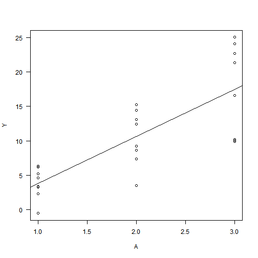

Normalidad
========================================================


```r
datos <- read.table("C:\\Curso 1\\DAN.csv", header = T)  # importar
names(datos)
```

```
## [1] "y"
```

```r
attach(datos)
```


## Gráficos de exploración de datos 


```r
par(mfrow = c(2, 2))  ## Marco de cuatro gráficos
plot(y)
boxplot(y)
hist(y, main = "")
y2 <- y
y2[52] <- 21.75
plot(y2)
```

 

```r
summary(y)
```

```
##    Min. 1st Qu.  Median    Mean 3rd Qu.    Max. 
##    1.90    2.24    2.41    2.42    2.57    2.98
```

```r
detach(datos)
```


## Gráficos de normalidad 
### Histograma 

```r
par(mfrow = c(1, 1))
peces <- read.csv("C:\\Curso 1\\PECES.csv", header = T)  # importar
names(peces)
```

```
## [1] "peso"
```

```r
mean(peces$peso)
```

```
## [1] 4.194
```

```r
max(peces$peso)
```

```
## [1] 15.53
```

```r
hist(peces$peso, breaks = -0.5:16.5, col = "orange", main = "")
lines(seq(0, 16, 0.1), length(peces$peso) * dnorm(seq(0, 16, 0.1), mean(peces$peso), 
    sqrt(var(peces$peso))))
```

 


## Utilizar el paquete CAR más la función qq.plot 
### qqplot

```r
library(car)
qq.plot(peces$peso)
```

```
## Warning: 'qq.plot' is deprecated.
## Use 'qqPlot' instead.
## See help("Deprecated") and help("car-deprecated").
```

 

```r
qqnorm(peces$peso)  ##muestra que se salen de la normalidad algunos datos 
qqline(peces$peso, lty = 2)  ## No linearidad
```

 


## Pruebas de normalidad 
### H0 = no hay diferencia entre las distribuciones
### HA = si hay diferencia entre las distribuciones
### Si se hacepta H0 quiere decir que los datos presetan una distribución normal

```r
shapiro.test(peces$peso)
```

```
## 
## 	Shapiro-Wilk normality test
## 
## data:  peces$peso
## W = 0.9165, p-value = 1.287e-10
```


## Transformación de variables

```r
logpeso <- log(peces$peso)
qqnorm(logpeso)
qqline(logpeso, lty = 2)  ##qqplot
```

 

```r
shapiro.test(x = logpeso)  ##Shapiro test
```

```
## 
## 	Shapiro-Wilk normality test
## 
## data:  logpeso
## W = 0.9905, p-value = 0.1007
```

[Ir al contenido](https://github.com/rubio-e/Tutorial_R/blob/main/README.md#m%C3%B3dulos)


